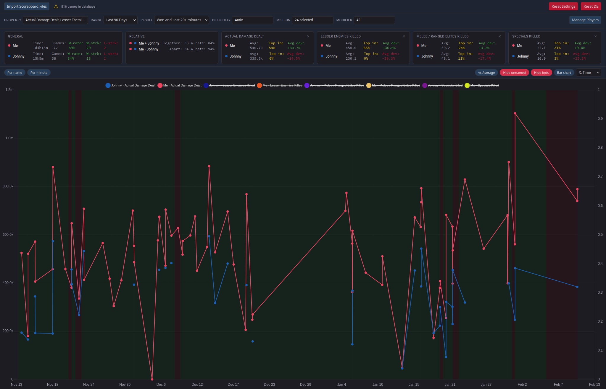

# Darktide Scoreboard Tracker

Track and visualize your Warhammer 40,000: Darktide performance across missions with interactive charts and detailed statistics.

## Quick-start

Just visit http://darktide.szydlo.eu

## What It Does

Import your scoreboard data and get rich analytics on player performance:

- **Interactive Charts** - Line and bar charts with hover tooltips showing full game context (date, mission, difficulty, duration, team stats)
- **Multi-Player Tracking** - Compare up to 5 stats across multiple players simultaneously
- **Deep Filtering** - Filter by difficulty, mission, modifiers, win/loss, date range, or last N games
- **Per-Minute Normalization** - Normalize any stat by game duration for fair comparison
- **vs. Average Mode** - See how each player deviates from the team average as a percentage
- **Win/Loss Shading** - Visual background markers showing game outcomes on the timeline
- **General Statistics** - Game count, win rate, best-performer counts, and averages per player
- **Player Management** - Assign custom names and colors to tracked players

## Getting Started

### Requirements

- A modern browser (Chrome, Edge, or Opera recommended for best experience)
- The [Scoreboard](https://www.nexusmods.com/warhammer40kdarktide/mods/22) Darktide mod installed and generating `.lua` scoreboard files

### Usage

1. **Open** `index.html` in your browser
2. **Click** "Choose Scoreboard Directory" and point it at your scoreboard folder
   - Typically located at `%APPDATA%/Fatshark/Darktide/scoreboard_tracker`
3. **Wait** for ingestion to finish - all data is parsed and stored locally in your browser
4. **Explore** - select properties, adjust filters, compare players

### Re-importing

Click "Re-scan Files" to pick up new scoreboard files. Only new files are processed; duplicates are skipped.

Click "Reset DB" to wipe all data and start fresh.

## Key Controls

| Control | Description |
|---|---|
| Property dropdown | Select which stat(s) to chart (e.g. Damage Dealt, Kills) |
| Time range | All Time, Last 7/30/90/365 days, Custom dates, Last N games |
| Difficulty | Sedition through Auric |
| Mission / Modifiers | Filter to specific missions or game modifiers |
| Result | All, Won, Won+Long Lost, Lost |
| Bar chart toggle | Switch between line (time-series) and bar (per-game) view |
| vs Average toggle | Show deviation from team average instead of raw values |
| Per minute toggle | Normalize values by game duration |
| X: Time / Game # | Change horizontal axis mode |
| Hide unnamed | Hide players without custom names |
| Hide bots | Hide AI companions |

## Technical Details

- Runs entirely in the browser - no server, no accounts, no data leaves your machine
- Data persisted in IndexedDB across sessions
- Built with Vue.js, Chart.js, and sql.js (in-browser SQLite)
- Firefox/Safari supported via file input fallback (no directory picker API)

## License

[PolyForm Noncommercial License 1.0.0](LICENSE.md)
